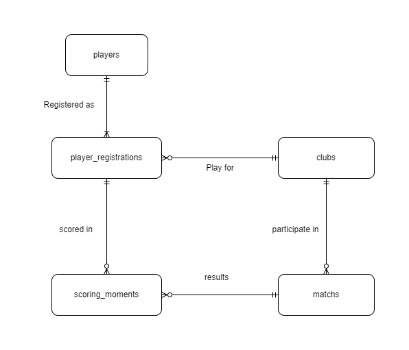

# Design Document

By Wahyu Bornok Augus Sinurat

Video overview: <https://youtu.be/ui1OZxrkkTY>

## Scope

This English Premier League Database has the purpose to track all the match and scoring moment in the league.
included in the database's scope is:

* Players, including basic player info
* Player Registrations, including basic registration info including the registration time
* Clubs, including the basic identifying info
* Matches, including the basic information of a match
* Scoring Moments, including the basic info of scoring, and the updated score in that match after the goal.

out of scope are elements like cards, coaches, and other attributes.

## Functional Requirements

This database will support:

* CRUD operations for players, matches, and scoring_moments
* Tracking all the the match and scoring moment, including multiple scoring_moment for a single game or player
* Aggregating the scoring_moments for certain use (goal scorer standings)
* Get the result of the certain matches

The system will not support for the goal assister or even player rating for certain match.

## Representation

### Entities

the database includes the following entities:

### Players

The `players` table includes:

* `id`: Specifies the unique identifier for each player. It is of type INTEGER and serves as the PRIMARY KEY for the table.
* `first_name`: Represents the first name of the player. It is of type TEXT and must not be NULL, storing textual data.
* `last_name`: Represents the last name of the player. It is of type TEXT and must not be NULL, storing textual data.
* `nationality`: Represents the nationality of the player. It is of type TEXT and must not be NULL, storing textual data.
* `dateofbirth`: Represents the date of birth of the player. It is of type NUMERIC and must not be NULL.

### Player Registrations

The `player_registrations` table includes:

* `id`: Specifies the unique identifier for each player registration. It is of type INTEGER and serves as the PRIMARY KEY for the table.
* `player_id`: Represents the identifier of the player registered. It is of type INTEGER and serves as a FOREIGN KEY referencing the "id" column in the "players" table.
* `club_id`: Represents the identifier of the club to which the player is registered. It is of type INTEGER and serves as a FOREIGN KEY referencing the "id" column in the "clubs" table.
* `Season`: Represents the season for which the player is registered. It is of type NUMERIC.
* `dateofregistration`: Represents the date of registration for the player. It is of type NUMERIC.

### Clubs

The `clubs` table includes:

* `id`: Specifies the unique identifier for each club. It is of type INTEGER and serves as the PRIMARY KEY for the table.
* `name`: Represents the name of the club. It is of type TEXT and must not be NULL, storing textual data.
* `city`: Represents the city where the club is located. It is of type TEXT and must not be NULL, storing textual data.
* `homebase`: Represents the home base or stadium of the club. It is of type TEXT and must not be NULL, storing textual data.

### Matches

The `matches` table includes:

* `id`: Specifies the unique identifier for each match. It is of type INTEGER and serves as the PRIMARY KEY for the table.
* `home`: Represents the identifier of the home team. It is of type INTEGER and serves as a FOREIGN KEY referencing the "id" column in the "clubs" table.
* `away`: Represents the identifier of the away team. It is of type INTEGER and serves as a FOREIGN KEY referencing the "id" column in the "clubs" table.
* `match_date`: Represents the date of the match. It is of type NUMERIC and must not be NULL.
* `season`: Represents the season of the match. It is of type NUMERIC and must not be NULL.
* `matchday`: Represents the matchday of the match. It is of type INTEGER and must not be NULL.

### Scoring Moments

The `scoring_moments` table includes:

* `id`: Specifies the unique identifier for each scoring moment. It is of type INTEGER and serves as the PRIMARY KEY for the table.
* `match_id`: Represents the identifier of the match in which the scoring moment occurred. It is of type INTEGER and serves as a FOREIGN KEY referencing the "id" column in the "matches" table.
* `player_id`: Represents the identifier of the player involved in the scoring moment. It is of type INTEGER and serves as a FOREIGN KEY referencing the "id" column in the "player_registration" table.
* `scoring_for`: Represents the club for which the goal was scored. It is of type INTEGER and serves as a FOREIGN KEY referencing the "id" column in the "clubs" table.
* `updated_score`: Represents the updated score after the goal was scored. It is of type NUMERIC.
* `minute`: Represents the minute in which the goal was scored. It is of type NUMERIC.

### Relationships

In this section you should include your entity relationship diagram and describe the relationships between the entities in your database.

as detailed by the diagram:

* One player is capable of registered as 1 or more player_registration (player). player_registrations is made by one and only one player.

* registered_player (player registration) is playing for one and only one club. a clubs is having 0, if club not yet play in the premier league, so don't have any record of player, or more player registration.

* registered_player (player registration) is scored in 0, when player never score a goal, or more scoring moments. scoring_moments is made by one and only one registered_player (player registrations).

* clubs is playing in zero, when it's doesn't play in premier league (the highest level of english football league), or more matches. matches is made by one and only one for each home and away team.

* matches is resulting for 0, or more scoring_moments. scoring_moments is made by one and only one match

## Optimizations

for the typical queries in `queries.sql`, it is common for users to access all the scoring moments from a particular player. for that reason, indexes are created on the `first_name`, `last_name`, column to speed the players identification

it's also common for people to check for scoring moments for spesific match, that what makes indexes for `match_id` speed the queries. this also what makes it important to create indexes for home and away

## Limitations

In this section you should answer the following questions:

The current schema only provided the goal scorer, but not the assister.

This databases doesn't support the case where player changing clubs in the same league.
